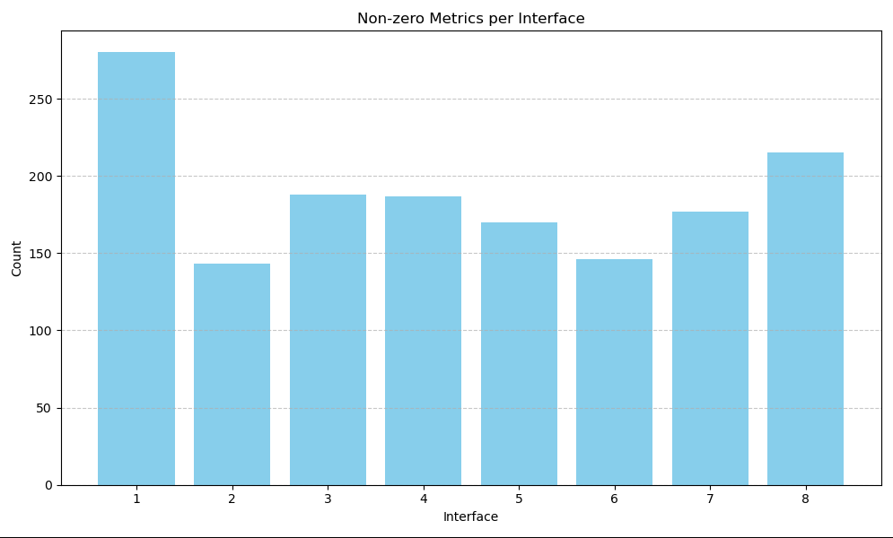
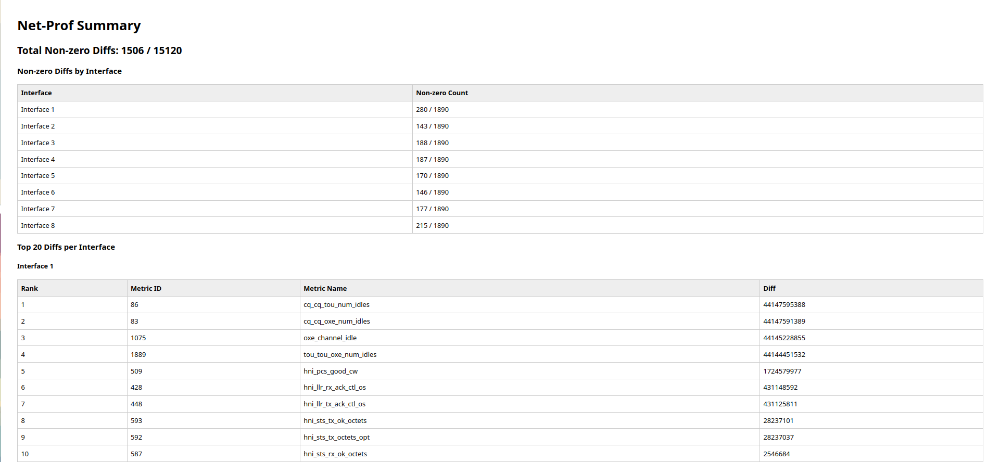

# net-prof

net-prof is a network profiler library aimed to profile the HPE Cray Cassini Network Interface Card (NIC) on a compute node to collect, analyze and visualize the network counter events. This tool will help to compare and diagnose a successful workload without any network issues with an unsuccessful workload due to a network issue.

## To Install

```
pip install net-prof
```

### Install in editable mode from project root:
```
pip install -e .
```
### Or use (workaround):
```
sys.path.insert(0, os.path.abspath(os.path.join(os.path.dirname(__file__), '..', 'src')))
```

## Functions
```
collect(input_directory, "counters.json")
summarize(before, after)
dump(summary)
dump_html(summary, output_html)
```

## To Use

```
    # Example Utilizing 8 NIC/interfaces!

import sys
import os
import net_prof

script_dir = os.path.dirname(os.path.abspath(__file__))

net_prof.collect("/home/kvelusamy/Downloads/dummy/sys/class/cxi", os.path.join(script_dir, "before.json"))
net_prof.collect("/home/kvelusamy/Downloads/dummy/sys/class/cxi", os.path.join(script_dir, "after.json"))

before = os.path.join(script_dir, "before.json")
after = os.path.join(script_dir, "after.json")

summary = net_prof.summarize(before, after)

output_html = os.path.join(script_dir, "report_all.html")  # e.g., tests/report.html
os.makedirs(os.path.join(script_dir, "charts"), exist_ok=True)

net_prof.dump_html(summary, output_html)
```

```
    # Example Utilizing a single NIC/interface (cxi0). collect() now supports functionality for single NIC and multi NIC's!

import net_prof
script_dir = os.path.dirname(os.path.abspath(__file__))

collect("../cxi/cxi0/device/telemetry", os.path.join(script_dir, "before.json"))

# dist.all_reduce(x, op=dist.ReduceOp.SUM) - or - os.execute('ping google.com')
    # ^ Process that should cause changes to the network runs
    
collect("../cxi/cxi0/device/telemetry", os.path.join(script_dir, "after.json"))

before = os.path.join(script_dir, "before.json")
after = os.path.join(script_dir, "after.json")

output_html = os.path.join(script_dir, "report.html")
os.makedirs(os.path.join(script_dir, "charts"), exist_ok=True)

summary = summarize(before, after)
dump(summary)
dump_html(summary, output_html)
```

## Features in Devolopment:
```
FIX -- report.html & report_2.html share the same charts when they shouldn't... (different data)
ADD -- Create a single unified test instead of having a bunch of tests.
ADD -- Adding more charts with mpl.
```

## Profiler Snapshots





## References

https://cpe.ext.hpe.com/docs/latest/getting_started/HPE-Cassini-Performance-Counters.html

https://github.com/argonne-lcf/net-prof

https://pypi.org/project/net-prof/

