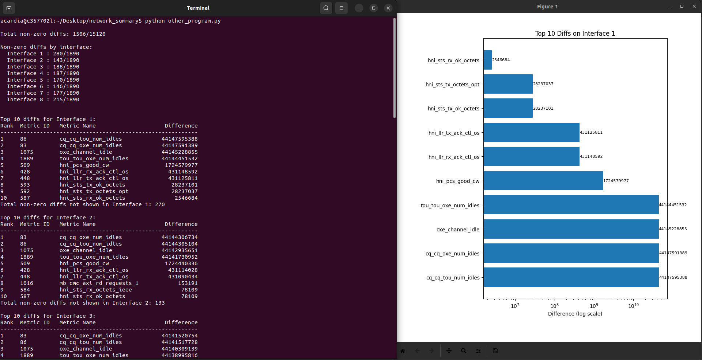
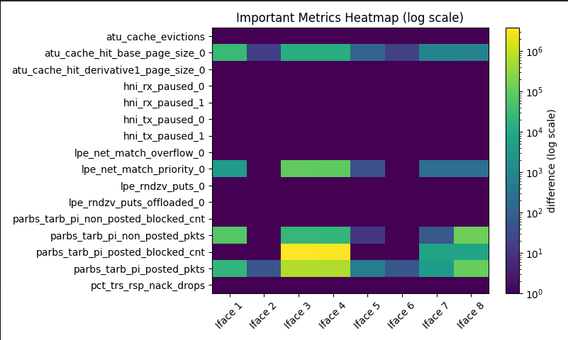

# net-prof

Net-prof is a network profiler aimed to profile the HPE Cray Cassini Network Interface Card (NIC) on a compute node to collect, analyze and visualize the network counter events.

### To install

```
pip install -r requirements.txt
pip install net-prof
```

### To Use

```
import net-prof

before_counters = net-prof.collect(metrics_location=/sys/class/cxi/cxi{device}/device/telemetry [optional])
dist.all_reduce(x, op=dist.ReduceOp.SUM)  
after_counters=net-prof.collect()

print(net-prof.summarize())
net-prof.dump_full(outfile=out.txt)
net-prof.visualize(outfile=report.html)
```

```
import net-prof

before_counters = net-prof.collect(metrics_location=/sys/class/cxi/cxi{device}/device/telemetry [optional])
os.execute('ping google.com')
after_counters=net-prof.collect()

print(net-prof.summarize())
```

### Profiler Snapshots





### References

https://cpe.ext.hpe.com/docs/latest/getting_started/HPE-Cassini-Performance-Counters.html
